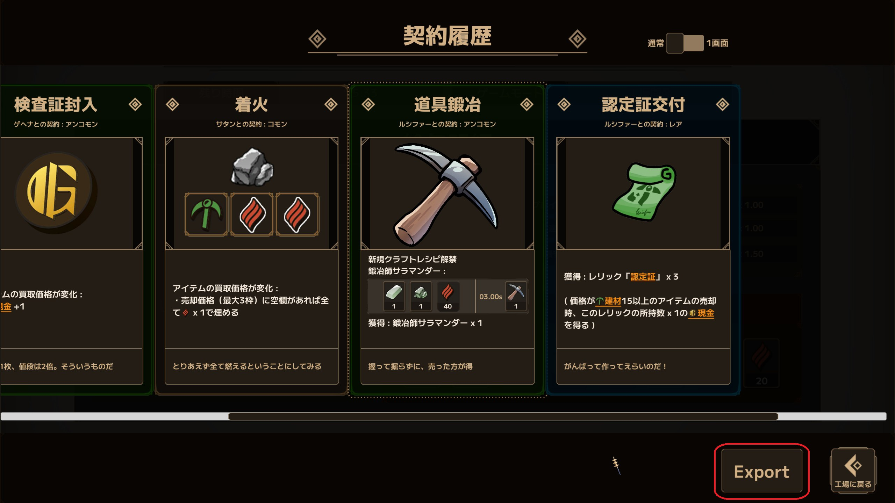
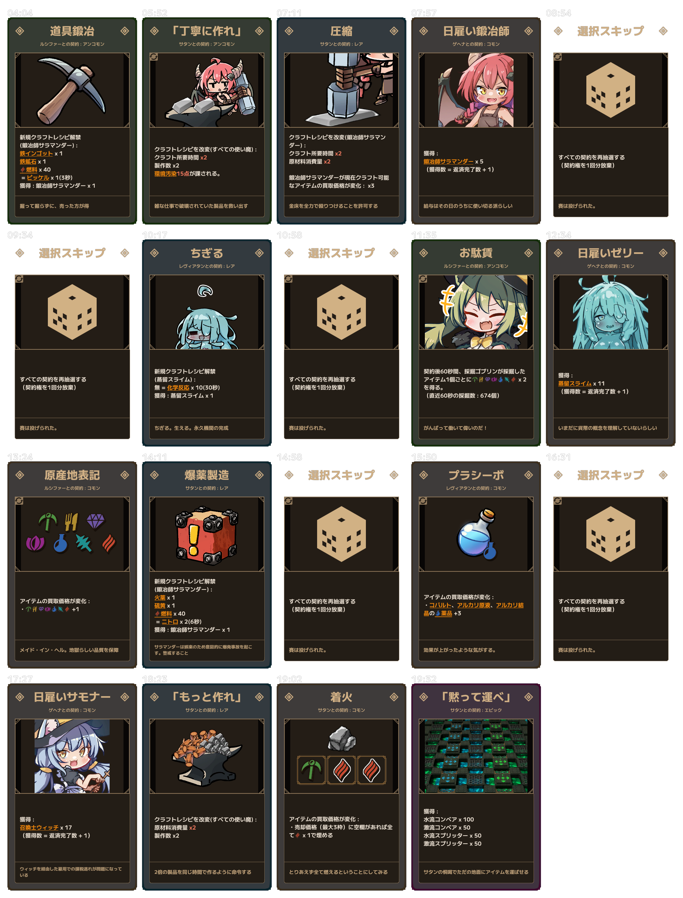

# LWF Pact History Exporter

Export your **Pact History** from *Lazy Witch's Factory* as a PNG or
JPEG image while keeping the game's pact-panel presentation.

> **Work in progress:** No public release is available yet.

[日本語はこちら](#日本語)

<!-- RELEASE TODO: after the public GitHub URL is known, replace the two
relative asset paths below with public raw GitHub image URLs, then verify them
in Thunderstore's Markdown Preview while signed out. -->

## What it does

The mod adds an **Export** button to the Pact History screen.



-   Exports the pact history using the game's pact-panel presentation.
-   Arranges up to five pact panels per row.
-   Supports lossless PNG and smaller JPEG output.
-   **Shows when each pact was acquired during the run** (when available).
-   Automatically splits image output when a single texture would exceed
    the runtime limit.

Unavailable timestamps are displayed as `—`.

### Example output


Exported images are saved under:

``` text
<GameDir>/PactHistoryExports/
```

Files are timestamped and begin with `PactHistory_`.

## Installation

### Thunderstore Mod Manager / r2modman

A public release is not available yet. Once released, installing through
a compatible Thunderstore mod manager will be the recommended method.

### Manual installation

Requires **BepInEx 5**.

1.  Install the Windows x64 version of BepInEx 5 into the folder
    containing `LazyWitchsFactory.exe`.
2.  Place `LwfPactHistoryExporter.dll` in:

``` text
<GameDir>/BepInEx/plugins/LwfPactHistoryExporter/
```

3.  Start the game.

If the plugin does not load, check `BepInEx/LogOutput.log`.

## Configuration

After the mod has loaded once, BepInEx creates:

``` text
<GameDir>/BepInEx/config/io.github.kusyua.lwf.pacthistoryexporter.cfg
```

Useful settings:

| Setting | Default | Description |
| --- | --- | --- |
| `IncludePactTimestamps` | `true` | Show each pact's in-run acquisition time above its panel. |
| `Format` | `png` | Output format: `png`, `jpg`, or `jpeg`. |
| `JpegQuality` | `90` | Initial JPEG quality from 1 to 100. |
| `JpegTargetSizeMiB` | `8` | Target JPEG size in MiB. `0` disables the target. This is not a guaranteed maximum. |

## Compatibility

-   Lazy Witch's Factory --- Steam, Windows x64
-   BepInEx 5
-   Tested with BepInEx `5.4.23.5` and Unity `6000.0.80f1` on
    2026-09-01.
-   Game updates may change private UI implementation details used by
    this mod and may require an update.

This mod does not redistribute extracted game assets or game assemblies.
The screenshots only document the MOD's runtime behavior. This is an
unofficial MOD and is not affiliated with or endorsed by the developer or
publisher of *Lazy Witch's Factory*.

------------------------------------------------------------------------

# 日本語

*Lazy Witch's Factory*
の**契約履歴**を、ゲーム内の契約パネルに近い見た目のまま PNG / JPEG
画像として保存する MOD です。

> **開発中:** 現在、公開リリースはまだありません。

## できること

契約履歴画面に **Export** ボタンを追加します。


-   契約履歴をゲーム内の契約パネル表示を利用して画像化
-   1行あたり最大5枚の契約パネルを配置
-   PNG / JPEG 出力に対応
-   **各契約をそのランで取得した時刻も一緒に表示できます**（取得時刻が利用できる場合）
-   出力画像がランタイムの単一テクスチャ上限を超える場合は、自動的に複数ファイルへ分割

取得時刻が利用できない場合は `—` と表示されます。

### 出力例



出力先:

``` text
<GameDir>/PactHistoryExports/
```

ファイル名にはタイムスタンプが付き、`PactHistory_` から始まります。

## インストール

### Thunderstore Mod Manager / r2modman

現在はまだ公開リリースがありません。リリース後は、対応する Thunderstore
系 MOD Manager からのインストールを推奨する予定です。

### 手動インストール

**BepInEx 5** が必要です。

1.  `LazyWitchsFactory.exe` のあるゲームフォルダへ Windows x64 版
    BepInEx 5 を導入します。
2.  `LwfPactHistoryExporter.dll` を以下へ配置します。

``` text
<GameDir>/BepInEx/plugins/LwfPactHistoryExporter/
```

3.  ゲームを起動します。

MODが読み込まれない場合は `BepInEx/LogOutput.log` を確認してください。

## 設定

MODを一度読み込むと、BepInExによって以下の設定ファイルが作成されます。

``` text
<GameDir>/BepInEx/config/io.github.kusyua.lwf.pacthistoryexporter.cfg
```

主な設定:

| 設定 | 初期値 | 内容 |
| --- | --- | --- |
| `IncludePactTimestamps` | `true` | 各契約のラン中の取得時刻をパネル上部に表示します。 |
| `Format` | `png` | 出力形式。`png` / `jpg` / `jpeg` を指定できます。 |
| `JpegQuality` | `90` | JPEGの初期品質（1～100）。 |
| `JpegTargetSizeMiB` | `8` | JPEGの目標ファイルサイズ（MiB）。`0`で無効。上限を保証するものではありません。 |

## 対応環境

-   Lazy Witch's Factory --- Steam / Windows x64
-   BepInEx 5
-   2026-09-01 時点で BepInEx `5.4.23.5` / Unity `6000.0.80f1`
    の環境で動作確認
-   ゲームのアップデートにより、MODが利用している内部UI実装が変更された場合はMOD側の更新が必要になることがあります。

このMODは抽出したゲームアセットやゲーム本体のアセンブリを再配布しません。掲載したスクリーンショットはMODの動作を示すものです。*Lazy Witch's Factory* の開発元・販売元とは関係のない非公式MODです。
